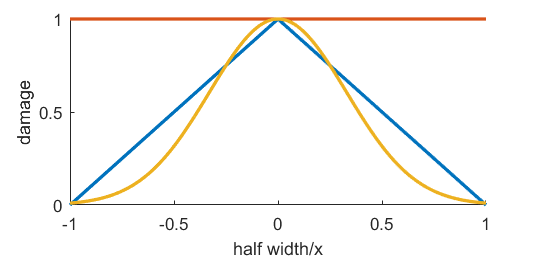

# Attack System notes:
I will add an attack system with multiple types of attacks. Attacks will have certain properties that define what kind of attack it will be. The damage dealt is instant. But effects such as fire can cause extra damage over a period of time.

1. `Field of fire: (forward|area)`
Specifies on what area the attack is projected. 'forward' will be an area directly in front of the entity. 'area' will be set around the entity.

2. `Size: number`
Size in pixels of the area in which damage is inflicted upon enemies.

3. `Falloff: (none|linear|gauss)`
Type of falloff, aka the reduction in damage as a function of distance. Linear will go to 0 at the FoF edge. With gauss, the value at the FoF edge will be 4% of peak damage.

4. `Damage: number`
Amount of damage at peak.

5. `Type: (direct|particle)`
Specifies the type of attack. 'direct' will inflict damage immediately. Particle will inflict damage when it touches anything.

6. `Effects: string array`
Effects applied to the targets, such as fire.

7. `Cooldown: number`
Amount of ticks for attack to be available again.

8. Animation...
